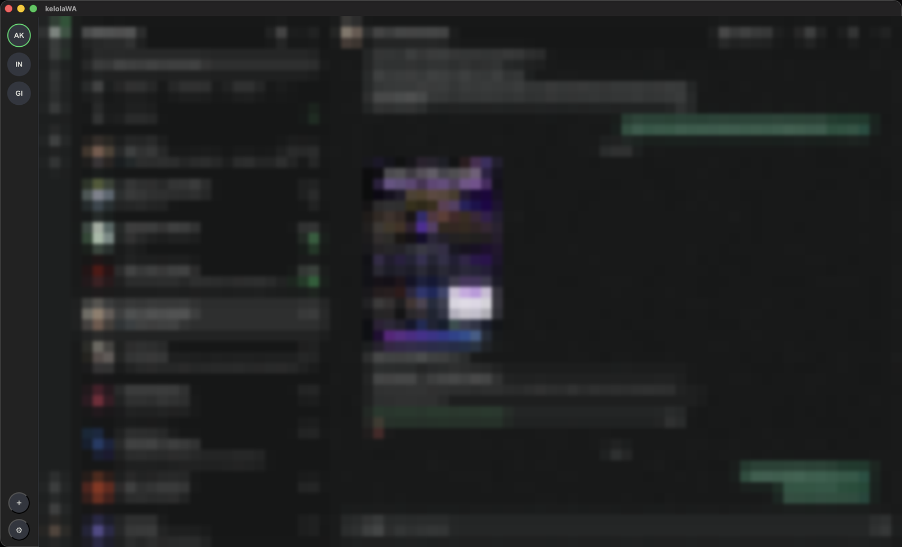

# kelolaWA

Unofficial WhatsApp Web desktop wrapper for Windows, macOS, and Linux — multiple accounts in one window, native OS notifications, tray icon, and voice/video calling.

> **Disclaimer:** kelolaWA is an independent, unofficial desktop client that wraps `web.whatsapp.com` in a native window. It is not affiliated with, endorsed by, or sponsored by WhatsApp or Meta Platforms, Inc. "WhatsApp" is a trademark of Meta Platforms, Inc.



_Chat list and conversation are blurred — that part is just regular WhatsApp Web. The rail on the left (with the three accounts) is what kelolaWA adds._

## Features

- **Multiple accounts** — add as many WhatsApp accounts as you like, each isolated in its own session (its own cookies/login, independent of the others). Switch between them from a rail on the left; every account keeps syncing in the background even while you're looking at a different one.
- **Native notifications** — real OS notification banners, not just the badge in the tab title. Clicking a notification brings the app to front and switches straight to that account's chat.
- **Voice & video calls** — camera and microphone access is wired up, so WhatsApp Web's own calling feature works normally.
- **Tray icon** — closing the window minimizes to the system tray instead of quitting; the app keeps running and notifying in the background.
- **Launch at login** — optionally start kelolaWA automatically when you log in, either with the window shown or minimized straight to the tray.
- **Rename / remove accounts** — double-click an account's avatar to rename it; hover and click the small × to remove it.

## Tech stack

- [Electron](https://www.electronjs.org/) + [electron-vite](https://electron-vite.org/) — app shell, windows, tray, per-account session isolation via `WebContentsView`
- [Svelte 5](https://svelte.dev/) + TypeScript — account rail and settings UI
- [Rust](https://www.rust-lang.org/) — a small sidecar process that persists app settings (window position, accounts list, preferences) to disk as JSON, communicating with the main process over stdin/stdout

## Requirements

- [Node.js](https://nodejs.org/) 18 or newer
- [Rust](https://www.rust-lang.org/tools/install) (`cargo`) — only needed to build the settings sidecar; installed automatically as part of `npm run dev` / `npm run build` if you have `cargo` on your `PATH`

## Getting started

```bash
git clone <this-repo-url>
cd kelolaWA
npm install
npm run dev
```

`npm run dev` builds the Rust sidecar once, then starts Electron with hot-reload for the renderer.

## Building for production

```bash
npm run build:mac     # macOS (.app, .dmg)
npm run build:win     # Windows (.exe, NSIS installer)
npm run build:linux   # Linux (AppImage, deb, snap)
```

Output goes to `dist/`. Note that on macOS, in dev mode the app always shows up as "Electron" in the menu bar and Dock — that's an Electron limitation for unpackaged apps. A `npm run build:mac` (or `npm run build:unpack` for a quick unsigned local build) produces a properly named/iconed `.app`.

## Project structure

```
src/
  main/            Electron main process
    index.ts       window/tray/menu setup, IPC handlers
    accounts.ts     per-account WebContentsView manager (session isolation, notifications)
    sidecar.ts      client for talking to the Rust settings sidecar
  preload/         contextBridge preload scripts (shell/settings window + per-account WhatsApp view)
  renderer/        Svelte UI (account rail, settings window)
rust-sidecar/      Rust binary that reads/writes settings.json over stdio
resources/         app + tray icons
build/             electron-builder resources (icons, entitlements)
```

## How multi-account works

Each account gets its own Electron session partition (except the first, which reuses the default session so an existing login isn't lost on upgrade). That means separate cookies, local storage, and IndexedDB per account — WhatsApp Web has no idea it's sharing the machine with other logged-in numbers. All accounts are loaded in the background on startup so notifications keep working for accounts you aren't currently viewing; only the active one is attached to the visible window.

## License

No license is granted. This repository is public for reference and portfolio purposes only — you may not copy, modify, or redistribute this code without the author's explicit permission.
